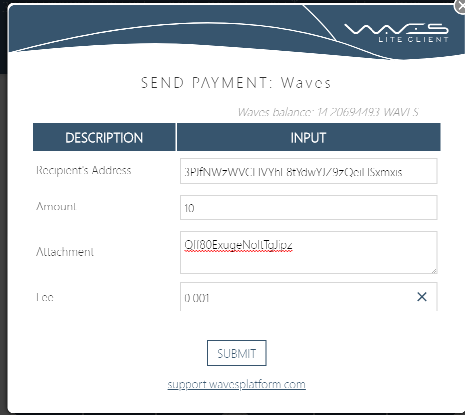

## 入金するには

### 入金タグの取得
tipwavesに対して
> @tipwaves deposit

と送信します

<blockquote class="twitter-tweet" data-partner="tweetdeck">
入金タグは以下です Qff80ExugeNoltTgJipz 取引所から直接入金しないでください。attachmentに必ず入金タグを入力してください。
&mdash; tipwaves(β版) (@tipwaves) <a href="https://twitter.com/tipwaves/status/983179260784402435?ref_src=twsrc%5Etfw">April 9, 2018</a></blockquote>

以上のようなリプライが来ますので入金タグをメモします。（この入金タグはアカウントごとで異なります。）

### 実際の入金
<blockquote class="twitter-tweet" data-lang="ja">
[info] 入金先アドレスは 3PJfNWzWVCHVYhE8tYdwYJZ9zQeiHSxmxis
&mdash; tipwaves(β版) (@tipwaves) <a href="https://twitter.com/tipwaves/status/939738236867317762?ref_src=twsrc%5Etfw">2017年12月10日</a></blockquote>

tipwaves専用入金アドレス
`3PJfNWzWVCHVYhE8tYdwYJZ9zQeiHSxmxis` に対して入金をしますが、このとき Attachment / Description（クライアントによって表記が異なります）に先の入金タグを入力します。

送金を行うと、tipwavesからダイレクトメッセージが届きます。それから暫く待つと、入金が承認され、利用できるようになります。

送金を行うと、tipwavesからダイレクトメッセージが届きます。それから暫く待つと、入金が承認され、利用できるようになります。
